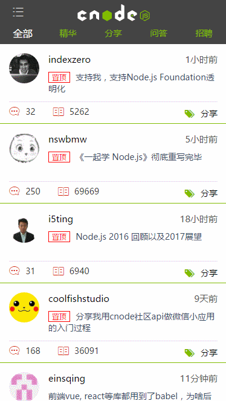

# vue2.x-cnode

### 关于项目

vue2.x Cnode社区是基于vue、vue-router、vuex、axios、es6开发，使用webpack构建工具编译打包项目

如果此开源项目对大家学习vue的全家桶有帮助，请给我一个star,因为你的star让我觉得这个开源有了价值！

[点击查看效果](https://dodov.github.io/vueCnode/index.html#/)



### vue1.x 项目
基于vue1.x已上线[积分购项目](http://m.51jfgou.com/jgouINF/weixin/index.html#!/)


### 下载 && 启动
```bash
# 克隆项目
git clone https://github.com/vincentSea/vue2.x-Cnode.git
# 安装依赖
npm install
# 启动开发环境
npm run dev
# 打包项目
npm run build
```

### 项目目录
```bash
│  .babelrc         // ES6语法编译配置
│  .gitignore       // git的文件过滤配置
│  index.tpl        // 程序入口html模板
│  package.json     // 项目相关信息配置，通过执行 npm init 命令创建
│  README.md        // 项目说明
│  
├─build             // webpack配置项
│       
├─src               // 项目主文件夹  
│  │  App.vue       // 页面入口文件
│  │  main.js       // 程序入口文件，加载各种公共组件
│  │  
│  ├─assets         // 静态资源，图片、公用样式、插件
│  ├─components     // 公共组件
│  ├─fetch          // 请求api
│  ├─pages          // 页面组件
│  ├─router         // 页面路由配置
|  |─util           // 公用方法 （过滤器、弹窗）
│  └─vuex           // vuex的状态管理
│              
└─static   
```


### webpack 配置
本项目是参考vue-cli快速构建项目，自己搭建项目。后续会改成webpack2.x的版本

### 安装babel

```bash
# 安装babel,编译ES6语法
cnpm install --save-dev babel-core babel-loader babel-preset-es2015 babel-plugin-transform-runtime  babel-preset-stage-2

```
```javascript
// 使用babel,编译ES6语法
{
    test: /\.js$/,
    loader: 'babel?presets=es2015',
    exclude: /node_modules/
}
```


### 图片路径与打包

```bash
# 安装引入图片需要依赖url-loader的加载器
cnpm install --save-dev url-loader
```
```javascript
{
    test: /\.(png|jpe?g|gif|svg)(\?.*)?$/,
    loader: 'url',
    query: {
        limit: 10000,
        name: '[name].[hash:7].[ext]'
    }
}
```

#### 样式引入打包 scss文件编译

```bash
cnpm install --save-dev css-loader sass-loader cssnext-loader
cnpm install --save-dev node-sass
```


```javascript
 // 打包引入样式
{
    test: /\.css$/,
    loader: "css-loader?sourceMap!cssnext-loader"
},
// scss文件编译 
{
    test: /\.scss$/,
    loader: "css-loader?sourceMap!sass-loader!cssnext-loader"
}
```